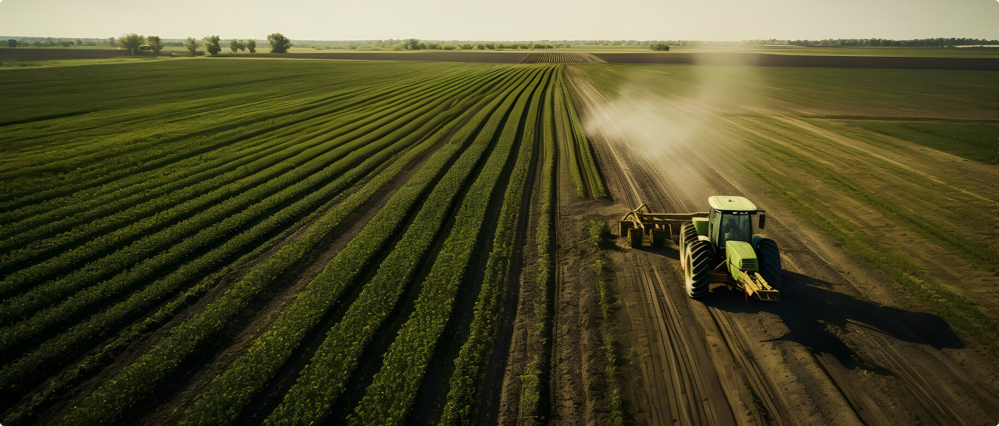

# 📸 BANCOS DE IMÁGENES PARA AGROCOL

## Guía completa para encontrar imágenes de follajes naturales

---

## 🆓 SITIOS GRATUITOS (RECOMENDADOS)

### 1. UNSPLASH ⭐⭐⭐⭐⭐
**URL:** https://unsplash.com

**✅ Por qué es el mejor:**
- Imágenes de altísima calidad (4K, 6K+)
- 100% gratis, incluso para uso comercial
- No requiere atribución
- Descarga inmediata sin registro

**🔍 Palabras clave en inglés:**
```
tropical foliage
monstera leaves
fern plants
palm leaves
botanical greenery
plant nursery
exotic plants
green foliage
tropical leaves
ornamental plants
philodendron
anthurium leaves
boston fern
maidenhair fern
tropical greenhouse
```

**🔗 Links directos útiles:**
- https://unsplash.com/s/photos/tropical-foliage
- https://unsplash.com/s/photos/monstera
- https://unsplash.com/s/photos/fern-plants
- https://unsplash.com/s/photos/palm-leaves
- https://unsplash.com/s/photos/plant-greenhouse

---

### 2. PEXELS ⭐⭐⭐⭐⭐
**URL:** https://www.pexels.com

**✅ Ventajas:**
- Totalmente gratis
- Excelente variedad de plantas
- Videos también (bonus)
- Fácil de usar

**🔍 Palabras clave:**
```
exotic plants
green leaves
botanical
plant warehouse
indoor plants
ornamental plants
tropical plants
houseplants
green foliage
plant collection
```

**🔗 Links directos:**
- https://www.pexels.com/search/tropical%20plants/
- https://www.pexels.com/search/green%20foliage/
- https://www.pexels.com/search/exotic%20plants/
- https://www.pexels.com/search/botanical/

---

### 3. PIXABAY ⭐⭐⭐⭐
**URL:** https://pixabay.com

**✅ Ventajas:**
- Gratis sin atribución
- Incluye ilustraciones y vectores
- Base de datos amplia

**🔍 Palabras clave:**
```
tropical plants
ornamental foliage
green plants
botanical garden
ferns
palm trees
tropical leaves
houseplants
```

**🔗 Link directo:**
- https://pixabay.com/images/search/tropical%20plants/

---

## 💎 SITIOS FREEMIUM (Gratis + Premium)

### 4. FREEPIK ⭐⭐⭐⭐
**URL:** https://www.freepik.com

**✅ Ideal para:**
- Iconos de plantas
- Ilustraciones vectoriales
- Gráficos para web
- Patrones de follajes

**⚠️ Nota:** Versión gratis requiere atribución. Premium no.

**🔍 Búsquedas recomendadas:**
```
foliage vector
botanical illustrations
plant icons
tropical leaves pattern
green leaf icon
export box icon
quality control icon
certification badge
```

**🔗 Secciones útiles:**
- https://www.freepik.com/search?format=search&query=tropical+leaves
- https://www.freepik.com/vectors/plant-icon
- https://www.freepik.com/photos/botanical

---

## 💰 SITIOS PREMIUM (Pago - Alta calidad B2B)

### 5. iSTOCK / GETTY IMAGES ⭐⭐⭐⭐⭐
**URL:** https://www.istockphoto.com / https://www.gettyimages.com

**✅ Por qué pagar:**
- Imágenes B2B específicas
- Fotos de logística y exportación
- Procesos de calidad
- Inspecciones fitosanitarias
- Muy profesionales

**🔍 Búsquedas B2B específicas:**
```
export logistics flowers
warehouse flowers
quality control plants
phytosanitary inspection
plant certification
foliage export
flower distribution center
agricultural export
plant quality control
greenhouse inspection
botanical warehouse
cargo flowers
flowers packing
export documentation
international trade flowers
```

**💡 Estas imágenes NO las encuentra gratis:**
- Bodegas de plantas
- Inspecciones de calidad
- Documentación fitosanitaria
- Procesos de empaque para exportación
- Logística de flores/follajes

**💵 Precio aproximado:**
- Desde $10-50 USD por imagen
- Paquetes disponibles
- Licencias extendidas disponibles

---

### 6. ADOBE STOCK ⭐⭐⭐⭐⭐
**URL:** https://stock.adobe.com

**✅ Ventajas:**
- Integración con Adobe Creative Cloud
- Calidad excepcional
- Licencias flexibles

**🔍 Búsquedas:**
```
Colombian plants
tropical export
botanical warehouse
foliage cultivation
ornamental plants business
```

**💵 Precio:**
- Desde $9.99/mes (10 imágenes)
- Planes desde $29.99/mes

---

## 📋 GUÍA DE IMÁGENES NECESARIAS

### Para la página principal (index.html):

#### 1. HERO SECTION (3 imágenes grandes)
**Dimensión:** 1920x1080px (Full HD)

**Slide 1:** Follajes tropicales frescos, primer plano
- Unsplash: "monstera deliciosa close up"
- Unsplash: "tropical leaves detailed"

**Slide 2:** Instalaciones/bodega con plantas
- iStock: "plant warehouse" ⭐ PREMIUM
- iStock: "greenhouse distribution"

**Slide 3:** Productos empacados listos para exportar
- iStock: "flowers packing export" ⭐ PREMIUM
- Getty: "plant shipping preparation"

#### 2. ABOUT SECTION (3-4 imágenes)
**Dimensión:** 800x600px

- Equipo trabajando con plantas
- Procesos de control de calidad
- Instalaciones de AGROCOL
- Certificaciones/documentos

**Dónde buscar:**
- Pexels: "people working plants"
- iStock: "quality control plants" ⭐

#### 3. SERVICES SECTION (4 imágenes)
**Dimensión:** 600x400px

Cada servicio necesita una imagen:
1. **Gestión Comercial:** Reunión de negocios / apretón de manos
2. **Aseguramiento de Calidad:** Inspector revisando plantas
3. **Cumplimiento Fitosanitario:** Documentos/certificados
4. **Logística:** Camión/avión de carga

**Dónde:**
- Unsplash: servicios generales (negocios)
- iStock: imágenes B2B específicas ⭐

#### 4. PRODUCTS SECTION (8 imágenes)
**Dimensión:** 600x600px (cuadradas)

Diferentes tipos de follajes:
- Monstera
- Helecho (fern)
- Palma
- Filodendro
- Anturio
- Costilla de Adán
- Helechos variados
- Follajes mixtos

**Dónde:**
- Unsplash: "monstera", "fern", "palm leaf"
- Pexels: "tropical plants"

#### 5. GALLERY (6-8 imágenes)
**Dimensión:** 1200x800px

Mix de:
- Productos finales
- Instalaciones
- Certificaciones
- Equipo de trabajo
- Proceso de empaque

---

## 🎯 ESTRATEGIA DE BÚSQUEDA

### Fase 1: GRATIS (Unsplash + Pexels)
**Tiempo:** 2-3 horas  
**Costo:** $0

Conseguir:
- Hero backgrounds (3)
- Productos individuales (8)
- Algunas imágenes de about/services

**Resultado:** 60-70% del sitio con imágenes reales

### Fase 2: PREMIUM (iStock/Getty)
**Tiempo:** 1 hora  
**Costo:** $50-150 USD

Conseguir:
- Imágenes B2B específicas (bodega, logística)
- Procesos de calidad/inspección
- Documentación fitosanitaria

**Resultado:** 100% del sitio profesional

---

## 💡 TIPS DE BÚSQUEDA

### ✅ HACER:
1. **Buscar en inglés:** Los bancos son internacionales
2. **Usar términos específicos:** "monstera deliciosa" mejor que "plant"
3. **Filtrar por orientación:** Horizontal para hero, cuadrado para productos
4. **Descargar en máxima resolución:** Para calidad profesional
5. **Verificar licencia:** Asegurar uso comercial permitido

### ❌ EVITAR:
1. Imágenes con watermark/marca de agua
2. Fotos borrosas o de baja calidad
3. Imágenes de personas sin release (si es necesario)
4. Contenido con copyright restrictivo

---

## 📐 DIMENSIONES RECOMENDADAS

| Sección | Tamaño ideal | Formato |
|---------|--------------|---------|
| Hero backgrounds | 1920x1080px | JPG |
| Service cards | 800x600px | JPG |
| Product images | 600x600px | JPG |
| Gallery images | 1200x800px | JPG |
| Logos | Variable | PNG/SVG |
| Icons | 64x64px | SVG |

---

## 🔧 OPTIMIZACIÓN DE IMÁGENES

**Después de descargar, optimizar:**

### Herramientas gratuitas:
1. **TinyPNG** (https://tinypng.com)
   - Comprime sin perder calidad
   - Reduce 50-70% de peso

2. **Squoosh** (https://squoosh.app)
   - De Google
   - Control total de compresión

3. **Optimizilla** (https://imagecompressor.com)
   - Compresión por lotes

**Meta:** Cada imagen < 200KB para web rápida

---

## 📝 CHECKLIST DE IMÁGENES

### Prioridad ALTA (hacer primero):
- [ ] 3 imágenes de Hero (1920x1080)
- [ ] Logo AGROCOL (SVG/PNG transparente)
- [ ] 8 imágenes de productos (600x600)

### Prioridad MEDIA:
- [ ] 4 imágenes de servicios (800x600)
- [ ] 3-4 imágenes de About
- [ ] 6 imágenes de Gallery

### Prioridad BAJA (opcional):
- [ ] Imágenes de testimonios
- [ ] Imágenes de blog/noticias
- [ ] Imágenes decorativas

---

## 🎨 REEMPLAZO EN EL CÓDIGO

Una vez descargadas las imágenes:

1. **Guardar en:** `assets/img/agrocol/`
2. **Nombrar claramente:** `hero-slide-1.jpg`, `product-monstera.jpg`
3. **Editar HTML:** Buscar y reemplazar rutas

**Ejemplo:**
```html
<!-- ANTES -->


<!-- DESPUÉS -->

```

---

## ✅ RESUMEN EJECUTIVO

**Para un sitio profesional al 100%:**

| Inversión | Tiempo | Resultado |
|-----------|--------|-----------|
| $0 (solo gratis) | 3-4 horas | Bueno (70% real) |
| $50-100 (mix) | 4-5 horas | Muy bueno (90% real) |
| $100-200 (premium) | 5-6 horas | Excelente (100% profesional) |

**Recomendación:** Empezar con sitios gratuitos (Unsplash + Pexels) y complementar con 5-10 imágenes premium de iStock para las secciones B2B específicas.

---

**Total de imágenes necesarias:** 25-30 imágenes  
**Tiempo estimado:** 4-6 horas de búsqueda y optimización  
**Inversión recomendada:** $50-100 USD para imágenes B2B premium  

---

¡Buena suerte con la búsqueda de imágenes! 🌿📸
